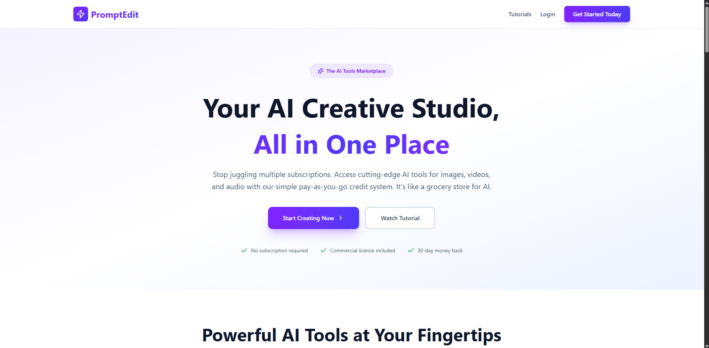
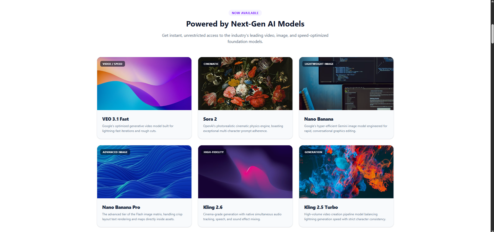
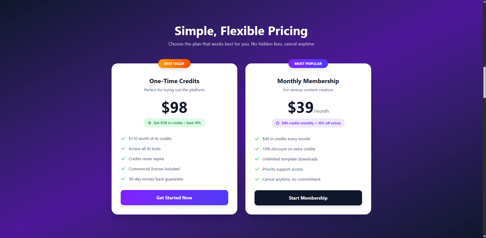
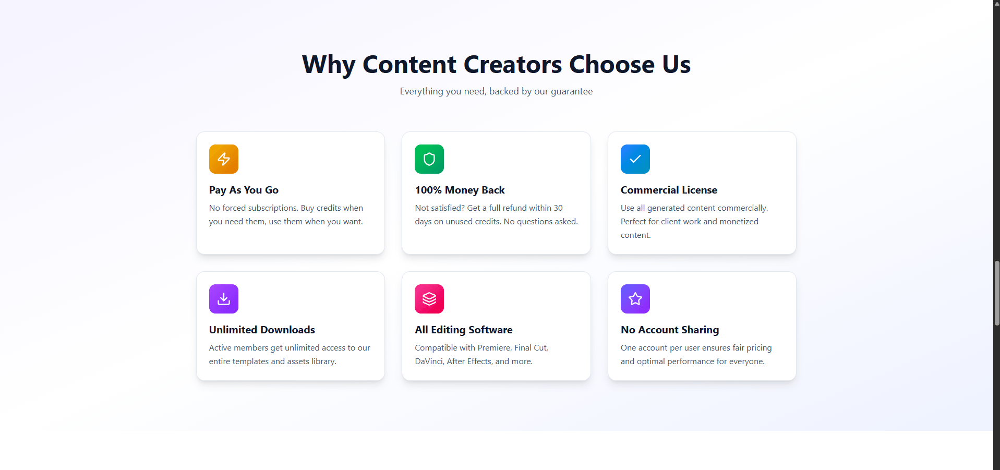
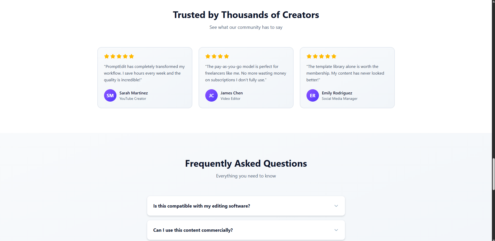

# 🚀 PE Sales & Landing Page

Welcome to the **PE** presentation repository. This project showcases a high-converting, modern presentation website tailored for **AI-driven content creation tools** designed specifically for online creators, video editors, and digital marketers.

---

## 🌟 Key Features Implemented

*   **Responsive Navigation:** Adaptive desktop layout that collapses into a native fluid mobile drawer.
*   **Interactive FAQs:** Accordion-style UI elements utilizing smooth Vue 3 transitions and custom Tailwind configurations.
*   **Dynamic Video Modals:** A perfectly centered native HTML `<dialog>` tutorial player driven by modern Vue `defineModel()` states.
*   **Premium Aesthetic:** Built using clean semantic HTML markup wrapped in custom gradients, backdrop-blurs, and rich typography.

---

## 📸 Project Walkthrough & Gallery

Below is a step-by-step visual tour of the user journey, layout structure, and components.

### 🗺️ Overview & Visual Tour

| Section & Viewport | Desktop Layout |
| :--- | :--- |
| **01. Hero & Navigation**   Global navigation header with modern backdrop blurs and call-to-actions. |  |
| **02. Core AI Tools Interface**   Visual presentation grid showing available AI content creation features. |  |
| **03. Pricing**   Filterable hub showcasing premium templates built for online creators. |  |
| **04. Templates Library**   In-depth breakdown of key unique selling points (USPs) and workflows. |  |
| **05. Feature Deep-Dive**   All features accessible to content creators. |  |
| **06. Interactive FAQ Area**   Accordion layout built for frequent user queries. |  |
| **07. Final Call-To-Action**   Structured tiers designed to maximize conversion pipelines. |  |
| **08. Footer**   High-converting exit section alongside standard site mapping. |  |

---

## 🛠️ Built With

*   **Vue 3 (Composition API)** – Structured with modern `script setup lang="ts"` blocks.
*   **Tailwind CSS** – Fully utilized utility classes for rapid custom styling, flex grids, and responsive breakpoints.
*   **TypeScript** – Provides rigid type definitions ensuring safer component composition.